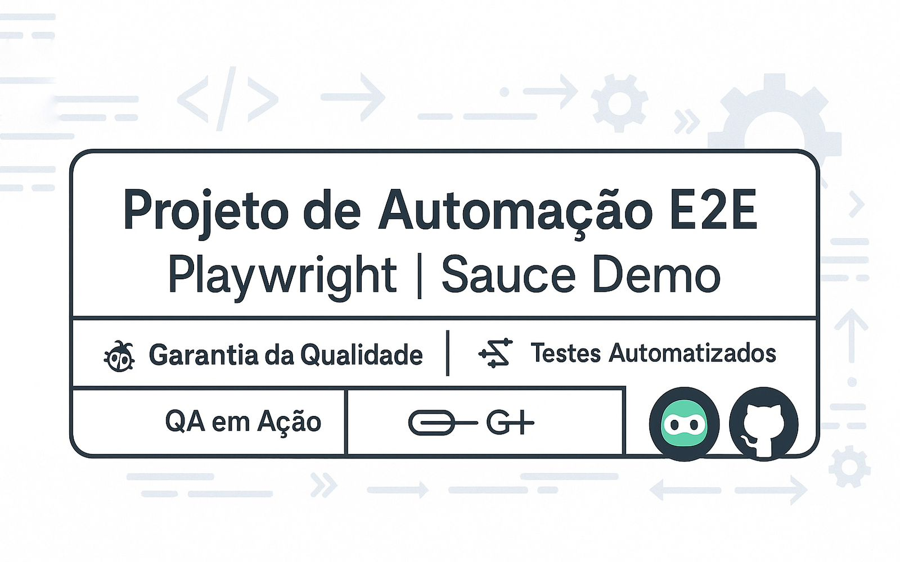
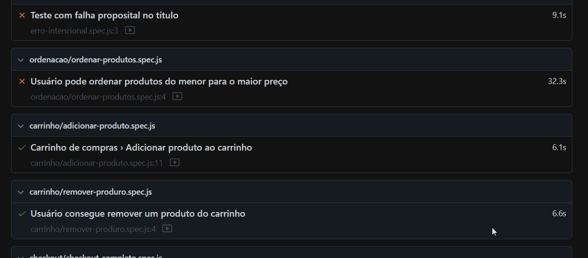
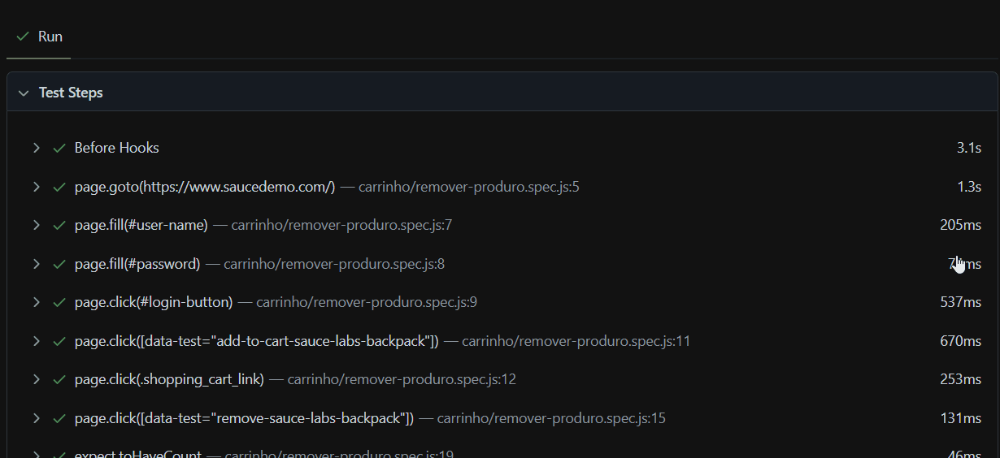
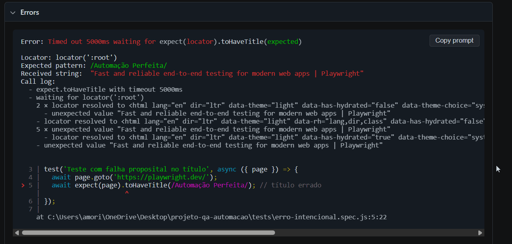

<p align="center">
  
</p>

<h1 align="center">Automação de Testes E2E com Playwright – SauceDemo</h1>

<p align="center">
  <a href="https://github.com/AgathaAmorimHC/qa-e2e-playwright-saucedemo">
    
  </a>
  <a href="https://github.com/AgathaAmorimHC/qa-e2e-playwright-saucedemo/issues">
    
  </a>
  <a href="https://github.com/AgathaAmorimHC/qa-e2e-playwright-saucedemo/blob/main/LICENSE">
    
  </a>
  <a href="https://www.linkedin.com/in/agathasiqueiradeamorim/" target="_blank">
    
  </a>
  <a href="https://github.com/AgathaAmorimHC" target="_blank">
    
  </a>
  <a href="https://www.codefactor.io/repository/github/agathaamorimhc/qa-e2e-playwright-saucedemo" target="_blank">
    
  </a>
</p>

---

## Sobre o Projeto

Automação de testes End-to-End (E2E) utilizando **Playwright** em **JavaScript**, focada em validar os fluxos críticos da aplicação web **SauceDemo** — uma plataforma de e-commerce para prática de testes.

Este projeto demonstra habilidades sólidas em automação para garantir a qualidade, estabilidade e performance dos principais processos do sistema, incluindo login, gerenciamento de carrinho, checkout e ordenação de produtos.

---

## Tecnologias e Ferramentas

- Playwright
- Node.js
- JavaScript (ES6+)
- Visual Studio Code
- Git & GitHub

---

## Objetivos dos Testes

- Validar login com credenciais válidas e inválidas
- Garantir funcionamento correto do logout
- Testar adição e remoção de itens no carrinho
- Validar fluxo completo de checkout
- Verificar ordenação dos produtos na interface
- Implementar testes negativos para validação robusta

---

## Estrutura do Projeto

```bash
projeto-qa-automacao
├── assets                 # Imagens e banners
├── fixtures               # Massa de dados (usuários)
│   └── users.json
├── tests                  # Casos de teste organizados por funcionalidade
│   ├── busca
│   ├── carrinho
│   ├── checkout
│   ├── login
│   ├── logout
│   └── ordenacao
├── package.json
├── playwright.config.js
└── README.md
```

---

## Como Executar Localmente

### Pré-requisitos

- Node.js instalado (versão 16+ recomendada)
- Git instalado

### Passos

```bash
git clone https://github.com/AgathaAmorimHC/qa-e2e-playwright-saucedemo.git
cd qa-e2e-playwright-saucedemo
npm install
npx playwright install
```

---

## Como Executar os Testes

Executar todos os testes:

```bash
npx playwright test
```

Executar testes de uma pasta específica:

```bash
npx playwright test tests/login
```

Executar um arquivo específico:

```bash
npx playwright test tests/checkout/checkout-completo.spec.js
```

Executar testes com interface gráfica:

```bash
npx playwright test --ui
```

---

## Relatórios de Teste

Gerar e visualizar relatório HTML interativo:

```bash
npx playwright show-report
```

---

## Evidências da Automação

### Execução Completa da Suíte



---

### Testes Bem-Sucedidos



---

### Falha Intencional para Validação



---

## Diferenciais Técnicos

- Organização modular para escalabilidade e manutenção
- Massa de dados externa via JSON para flexibilidade
- Testes negativos estratégicos para robustez
- Relatórios automáticos para transparência e análise
- Preparação para integração com pipelines CI/CD

---

## Próximos Passos

- Implementar padrão Page Object Model (POM)
- Adicionar testes responsivos (mobile/tablet/web)
- Incluir testes de API para cobertura backend
- Configurar CI/CD com GitHub Actions
- Adotar relatórios avançados como Allure
- Habilitar execução paralela em múltiplos navegadores

---

## Contato

**Agatha Amorim**  🐞
[LinkedIn](https://www.linkedin.com/in/agathasiqueiradeamorim/) | [GitHub](https://github.com/AgathaAmorimHC)

---

> Mais que testar, entrego qualidade.  
> Cada automação reflete compromisso técnico e estratégico, assegurando processos seguros, escaláveis e eficientes.  
> Qualidade não é requisito, é cultura.

